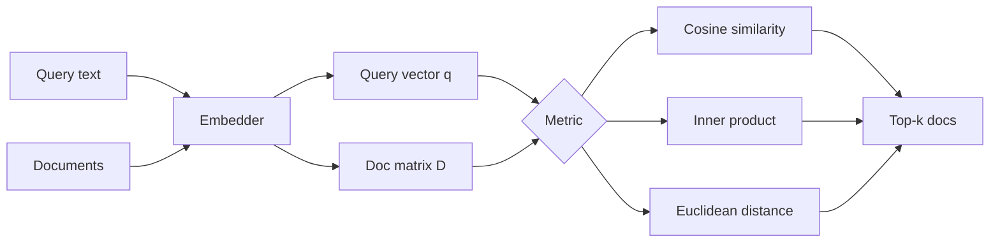

# A Comparison of Distance & Similarity Metrics
# Cosine Similarity · Inner Product (Dot Product) · Euclidean Distance

**Which metric should you use for RAG retrieval?** This project compares **Cosine Similarity**, **Inner Product (Dot Product)**, and **Euclidean Distance (L2)** — how they differ mathematically, when their rankings disagree, and what that means for embedding search.

NumPy / SciPy / PyTorch appear only as **execution backends** (secondary): they compute the same three metrics with different APIs.

| Metric | Formula | Rank by | Sensitive to magnitude? |
|---|---|---|---|
| **Cosine Similarity** | \((a \cdot b) / (\|a\|\|b\|)\) | Higher is better | No (direction only) |
| **Inner Product** | \(a \cdot b\) | Higher is better | Yes |
| **Euclidean Distance** | \(\|a - b\|_2\) | Lower is better | Yes |

---

## Table of contents

1. [Why metric choice matters](#why-metric-choice-matters)
2. [The three metrics](#the-three-metrics)

---

## Why metric choice matters

In RAG you embed a query and documents, then **rank documents by a score**. That score is almost always one of three metrics. They are *not* interchangeable when vectors have different lengths:

- The **metric** defines *what* “similar” means.
- The **library** (NumPy, SciPy, PyTorch) only defines *how* you compute it.

This repo’s demos and tests treat **metric type as the primary variable**.

---

## The three metrics

### Cosine Similarity

\[
\text{cosine}(a, b) = \frac{a \cdot b}{\|a\|\,\|b\|} = \cos\theta
\]

| | |
|---|---|
| **Measures** | Angle between vectors (direction / semantic alignment) |
| **Range** | \([-1, 1]\) for real embeddings (often \(\approx [0, 1]\) for text) |
| **Ranking** | `argmax` — higher is more similar |
| **Magnitude** | Cancelled out by the norms in the denominator |
| **RAG fit** | Default for semantic text search when length should not affect relevance |

**Trade-off:** Two vectors with the same direction score identically whether one is short or long. If magnitude encodes something meaningful (confidence, TF-weighted features), cosine throws that away.

### Inner Product (Dot Product)

\[
a \cdot b = \sum_i a_i b_i = \|a\|\,\|b\|\,\cos\theta
\]

| | |
|---|---|
| **Measures** | Alignment **×** magnitude |
| **Range** | Unbounded |
| **Ranking** | `argmax` — higher is more similar |
| **Magnitude** | Longer vectors score higher |
| **RAG fit** | Extremely common once embeddings are **L2-normalized** (then ≡ cosine); also used when length is intentional |

**Trade-off:** A long, only roughly aligned vector can beat a short, perfectly aligned one. That is often undesirable for text embeddings unless you normalize first.

### Euclidean Distance (L2)

\[
\|a - b\|_2 = \sqrt{\sum_i (a_i - b_i)^2}
\]

| | |
|---|---|
| **Measures** | Straight-line distance in embedding space |
| **Range** | \([0, \infty)\) |
| **Ranking** | `argmin` — **lower** is more similar |
| **Magnitude** | Absolute position and length both matter |
| **RAG fit** | Natural for “nearest neighbor” framing; many ANN indexes default to L2 |

**Trade-off:** Sensitive to scale. For **unit-normalized** vectors, \(\|a-b\|_2^2 = 2 - 2\,(a\cdot b)\), so Euclidean ranking is monotonically equivalent to cosine / inner product.

---
