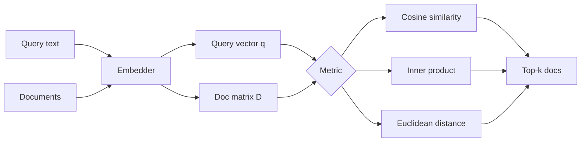
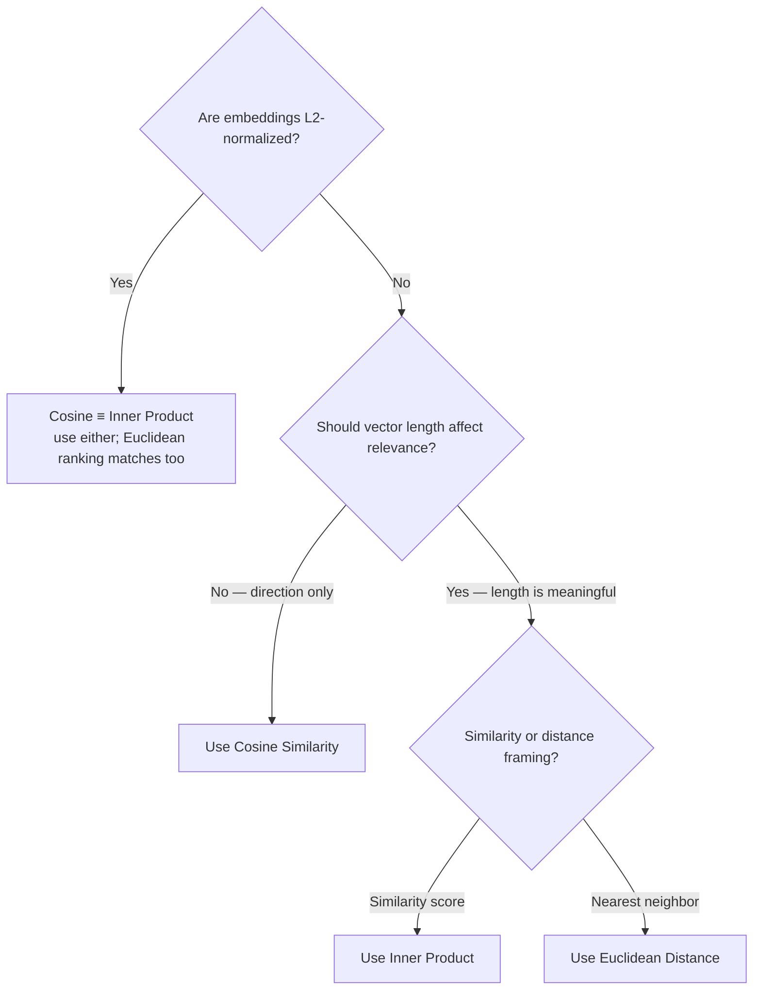

# A Comparison of Distance & Similarity Metrics
# Cosine Similarity · Inner Product (Dot Product) · Euclidean Distance

**Which metric should you use for RAG retrieval?** This project compares **Cosine Similarity**, **Inner Product (Dot Product)**, and **Euclidean Distance (L2)** — how they differ mathematically, when their rankings disagree, and what that means for embedding search.

NumPy / SciPy / PyTorch appear only as **execution backends** (secondary): they compute the same three metrics with different APIs.

| Metric | Formula | Rank by | Sensitive to magnitude? |
|---|---|---|---|
| **Cosine Similarity** | \((a \cdot b) / (\|a\|\|b\|)\) | Higher is better | No (direction only) |
| **Inner Product** | \(a \cdot b\) | Higher is better | Yes |
| **Euclidean Distance** | \(\|a - b\|_2\) | Lower is better | Yes |

---

## Table of contents

1. [Why metric choice matters](#why-metric-choice-matters)
2. [The three metrics](#the-three-metrics)
3. [Head-to-head comparison](#head-to-head-comparison)
4. [When rankings disagree](#when-rankings-disagree)
5. [Normalization: cosine ≡ inner product](#normalization-cosine--inner-product)
6. [Decision guide for RAG](#decision-guide-for-rag)
7. [Worked example](#worked-example)
8. [Project structure](#project-structure)
9. [Quick start](#quick-start)
10. [Execution backends (secondary)](#execution-backends-secondary)

---

## Why metric choice matters

In RAG you embed a query and documents, then **rank documents by a score**. That score is almost always one of three metrics. They are *not* interchangeable when vectors have different lengths:



- The **metric** defines *what* “similar” means.
- The **library** (NumPy, SciPy, PyTorch) only defines *how* you compute it.

This repo’s demos and tests treat **metric type as the primary variable**.

---

## The three metrics

### Cosine Similarity

\[
\text{cosine}(a, b) = \frac{a \cdot b}{\|a\|\,\|b\|} = \cos\theta
\]

| | |
|---|---|
| **Measures** | Angle between vectors (direction / semantic alignment) |
| **Range** | \([-1, 1]\) for real embeddings (often \(\approx [0, 1]\) for text) |
| **Ranking** | `argmax` — higher is more similar |
| **Magnitude** | Cancelled out by the norms in the denominator |
| **RAG fit** | Default for semantic text search when length should not affect relevance |

**Trade-off:** Two vectors with the same direction score identically whether one is short or long. If magnitude encodes something meaningful (confidence, TF-weighted features), cosine throws that away.

### Inner Product (Dot Product)

\[
a \cdot b = \sum_i a_i b_i = \|a\|\,\|b\|\,\cos\theta
\]

| | |
|---|---|
| **Measures** | Alignment **×** magnitude |
| **Range** | Unbounded |
| **Ranking** | `argmax` — higher is more similar |
| **Magnitude** | Longer vectors score higher |
| **RAG fit** | Extremely common once embeddings are **L2-normalized** (then ≡ cosine); also used when length is intentional |

**Trade-off:** A long, only roughly aligned vector can beat a short, perfectly aligned one. That is often undesirable for text embeddings unless you normalize first.

### Euclidean Distance (L2)

\[
\|a - b\|_2 = \sqrt{\sum_i (a_i - b_i)^2}
\]

| | |
|---|---|
| **Measures** | Straight-line distance in embedding space |
| **Range** | \([0, \infty)\) |
| **Ranking** | `argmin` — **lower** is more similar |
| **Magnitude** | Absolute position and length both matter |
| **RAG fit** | Natural for “nearest neighbor” framing; many ANN indexes default to L2 |

**Trade-off:** Sensitive to scale. For **unit-normalized** vectors, \(\|a-b\|_2^2 = 2 - 2\,(a\cdot b)\), so Euclidean ranking is monotonically equivalent to cosine / inner product.

---

## Head-to-head comparison

| Question | Cosine | Inner Product | Euclidean |
|---|---|---|---|
| Sensitive to vector length? | No | Yes | Yes |
| Good with unit-normalized embeddings? | Ideal | ≡ cosine | Monotone ↔ cosine |
| Ranking rule | `argmax` | `argmax` | `argmin` |
| Intuition | “Same direction?” | “Aligned *and* strong?” | “How far apart?” |
| Typical text-RAG default | Yes | Yes (if normalized) | Sometimes (ANN / L2 indexes) |
| Performance (dense brute force) | Normalize + matmul, or fused cosine | Single matmul | `cdist` / squared L2 |

### Performance characteristics (dense retrieval)

For a corpus of \(n\) vectors in dimension \(d\):

| Metric | Dominant cost | Notes |
|---|---|---|
| Inner product | \(O(nd)\) matmul `D @ q` | Fastest when vectors are already normalized |
| Cosine | \(O(nd)\) + norm costs | Often implemented as normalize-once + inner product |
| Euclidean | \(O(nd)\) | Squared L2 avoids `sqrt` for ranking; still \(O(nd)\) |

At RAG prototype scale (thousands of docs), all three are fine on CPU. At millions of vectors, use an ANN index / vector DB — the **metric choice still matters** for recall quality even when the index changes.

---

## When rankings disagree

Magnitudes break ties between metrics. The repo ships a 2D demo where each metric picks a **different** winner:

| Doc | Geometry | Favored by |
|---|---|---|
| A | Short, tightly aligned with the query | **Cosine** |
| B | Long, roughly aligned | **Inner Product** |
| C | Closest point to the query | **Euclidean** |

```bash
python examples/run_comparison.py
```

You should see raw-vector winners disagree, then agree (cosine ≡ inner product) after L2-normalization.

---

## Normalization: cosine ≡ inner product

Practical RAG pattern:

1. Embed query and documents  
2. **L2-normalize** every vector to unit length  
3. Cosine similarity collapses to the **inner product**  
4. Rank with `argmax` on `D @ q`  

```text
cosine(a, b) = a·b    when ||a|| = ||b|| = 1
```

Many embedding models already return normalized vectors. In that case, “cosine search” and “dot-product search” are the same operation — pick whichever API your stack exposes.

---

## Decision guide for RAG



| Situation | Prefer |
|---|---|
| Semantic text embeddings (typical RAG) | **Cosine**, or **inner product** after normalize |
| Embeddings already unit-normalized | **Inner product** (≡ cosine) for a single matmul |
| Magnitude should matter | **Inner product** or **Euclidean** — be explicit |
| Thinking in “distance to nearest neighbor” | **Euclidean** (or cosine *distance* = `1 − cosine`) |
| ANN index that only supports L2 | **Euclidean** on normalized vectors ≈ cosine ranking |

---

## Worked example

Sample documents (polysemous “bugs”):

```python
documents = [
    "Bugs introduced by the intern had to be squashed by the lead developer.",
    "Bugs found by the quality assurance engineer were difficult to debug.",
    "Bugs are common throughout the warm summer months, according to the entomologist.",
    "Bugs, in particular spiders, are extensively studied by arachnologists.",
]
```

**Query:** *Who is responsible for a coding project and fixing others' mistakes?*

```python
from src.compare import compare_metrics
from src.metrics import Metric, l2_normalize

# docs: (n, d), query: (d,)  — from your embedder
docs_n = l2_normalize(docs, axis=1)
query_n = l2_normalize(query)

comparison = compare_metrics(docs_n, query_n)
for result in comparison.results:
    print(result.display_name, "→ doc", result.best_index, "score", result.scores[result.best_index])
```

With unit-normalized embeddings, Cosine and Inner Product return the **same** top document (and the same scores). Euclidean returns the same top document via `argmin`.

**Expected semantic hit** (coding / ownership sense of “bugs”):

> `Bugs introduced by the intern had to be squashed by the lead developer.`

---

## Project structure

```text
Vector-Similarity-Metrics-for-RAG/
├── README.md
├── LICENSE
├── pyproject.toml
├── requirements.txt
├── src/
│   ├── compare.py                 # Primary: compare_metrics(); secondary: backends
│   ├── data/
│   │   └── samples.py             # RAG docs + magnitude-disagreement vectors
│   └── metrics/
│       ├── types.py               # Metric enum, formulas, ranking rules
│       ├── scoring.py             # Score / rank by metric
│       └── backends/              # Secondary execution paths
│           ├── manual.py
│           ├── numpy_backend.py
│           ├── scipy_backend.py
│           └── torch_backend.py
├── examples/
│   └── run_comparison.py          # Metric-first CLI demo
└── tests/
    └── test_metrics.py            # Disagreement, normalization, backend parity
```

---

## Quick start

```bash
cd Vector-Similarity-Metrics-for-RAG
python3 -m venv .venv
source .venv/bin/activate
pip install -r requirements.txt

# Compare Cosine vs Inner Product vs Euclidean
python examples/run_comparison.py

# Optional: also show Manual / NumPy / SciPy / PyTorch parity
python examples/run_comparison.py --with-backends

# Tests (no model download required)
pytest -q
```

---

## Execution backends (secondary)

Libraries are interchangeable ways to **implement** a metric — not the thing being compared:

| Backend | Role |
|---|---|
| **Manual** | Explicit loops — best for learning the formulas |
| **NumPy** | Default reference for CPU batch scoring |
| **SciPy** | `spatial.distance` / `cdist` helpers |
| **PyTorch** | Tensor path (GPU / model-adjacent stacks) |

Parity across backends is checked in tests and via `--with-backends`. If backends disagree, that is a bug; if **metrics** disagree, that is expected geometry.

---

## License

MIT — see [LICENSE](LICENSE).
