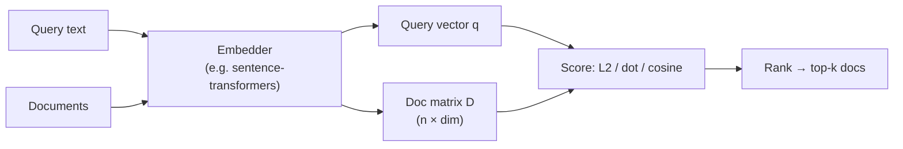
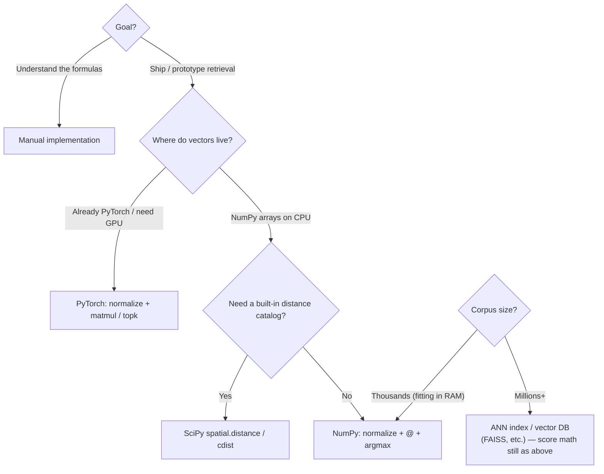

# NumPy / SciPy / Torch Similarity for RAG

**Manual math vs NumPy vs SciPy vs PyTorch** — the same vector similarity metrics (L2, dot product, cosine) computed several ways so you can see *when* to use each library and *how* the mechanisms differ for RAG retrieval.

| | Manual | NumPy | SciPy | PyTorch |
|---|---|---|---|---|
| Style | Explicit formulas | Array ops / broadcasting | Distance utility APIs | Tensor ops + `nn.functional` |
| Best for | Learning the math | Fast CPU batching | Ready-made pairwise distances | GPU / deep-learning stacks |
| Typical RAG role | Teaching / debugging | Embedding matrices on CPU | Quick `cdist` / `pdist` | Online retrieval next to models |

---

## Table of contents

1. [Problem & approach](#problem--approach)
2. [Similarity metrics at a glance](#similarity-metrics-at-a-glance)
3. [Library comparison matrix](#library-comparison-matrix)
4. [Mechanism differences](#mechanism-differences)
5. [When to use which](#when-to-use-which)
6. [Worked example: cosine search by hand](#worked-example-cosine-search-by-hand)
7. [Decision guide](#decision-guide)
8. [Wrap-up](#wrap-up)
9. [Project structure](#project-structure)
10. [Quick start](#quick-start)

---

## Problem & approach

In RAG, you embed a query and documents into vectors, then **rank documents by similarity** to the query. The ranking math is usually one of:

| Metric | What it measures | Higher / lower wins? |
|---|---|---|
| **L2 (Euclidean) distance** | Straight-line distance between vectors | **Lower** is more similar |
| **Dot product** | Alignment × magnitude | **Higher** is more similar (as similarity) |
| **Cosine similarity** | Angle between vectors (direction only) | **Higher** is more similar (max 1 when unit-normalized) |

This comparison shows how to compute those metrics:

1. **By hand** — write the formulas yourself (clearest for learning)
2. **NumPy** — vectorized array math (default for CPU notebooks / scripts)
3. **SciPy** — battle-tested distance helpers (`spatial.distance`)
4. **PyTorch** — tensor APIs, especially when embeddings already live on GPU

---

## Similarity metrics at a glance

### Cheat sheet

| Metric | Formula (idea) | Needs normalization? | Common API shapes |
|---|---|---|---|
| L2 distance | \(\|a - b\|_2\) | Optional (scale still matters) | Manual loop, `np.linalg.norm`, `scipy.spatial.distance.euclidean`, `torch.cdist` |
| Dot product similarity | \(a \cdot b\) | Often yes for fair ranking | `@` / `np.dot`, `torch.matmul` |
| Dot product distance | often \(-a \cdot b\) or \(1 - a\cdot b\) (context-dependent) | Same as above | Derived from similarity |
| Cosine similarity | \(\dfrac{a\cdot b}{\|a\|\|b\|}\) | Built into the formula; **unit-normalize first** → cosine ≡ dot | Manual, `sklearn`/`scipy`, `F.cosine_similarity`, or normalize + `@` |
| Cosine distance | \(1 - \text{cosine similarity}\) | Same as cosine | `scipy.spatial.distance.cosine` |

### Metric comparison matrix (RAG retrieval)

| Question | L2 distance | Dot product | Cosine similarity |
|---|---|---|---|
| Sensitive to vector length? | Yes | Yes | No (direction only) |
| Good when embeddings are unit-normalized? | Yes (then related to cosine) | Yes (then ≡ cosine) | Ideal |
| Typical RAG embedding models | Works | Common with normalized embeddings | Very common default |
| Ranking rule | `argmin` distance | `argmax` similarity | `argmax` similarity |
| Intuition | “How far apart?” | “How aligned *and* strong?” | “How aligned in meaning space?” |

> **Practical RAG tip:** Many embedding models already L2-normalize vectors. After that, **cosine similarity ≡ dot product**, so retrieval can use a single matrix multiply: `docs @ query.T`.

---

## Library comparison matrix

### Capabilities

| Concern | Manual | NumPy | SciPy | PyTorch |
|---|---|---|---|---|
| Teaches the math | Excellent | Good | Opaque helpers | Good if you know tensors |
| Boilerplate | High | Low | Lowest for pairwise distances | Low–medium |
| Batch query × corpus | You write loops / matmul | `A @ B.T`, broadcasting | `cdist` / `pdist` | `matmul`, `cdist`, `topk` |
| GPU acceleration | No | No (CPU) | No (CPU) | Yes (CUDA / MPS) |
| Autograd / training | No | No | No | Yes |
| Dependency weight | None | Light | Medium | Heavier |
| Idiomatic in ML notebooks | Rare outside tutorials | Very common | Common for distances | Common next to models |

### How you typically call each metric

| Metric | Manual | NumPy | SciPy | PyTorch |
|---|---|---|---|---|
| L2 distance | \(\sqrt{\sum (a_i-b_i)^2}\) | `np.linalg.norm(a-b, axis=-1)` | `distance.euclidean` / `cdist(..., 'euclidean')` | `torch.cdist` / `torch.norm(a-b, dim=-1)` |
| Dot product | \(\sum a_i b_i\) | `a @ b` / `np.dot` | (use NumPy; SciPy is distance-focused) | `torch.dot` / `a @ b` |
| Cosine similarity | \(\frac{a\cdot b}{\|a\|\|b\|}\) | normalize rows → `@` | `1 - distance.cosine` or `cdist(..., 'cosine')` then convert | `F.normalize` + `@`, or `F.cosine_similarity` |

### Strengths & trade-offs

| Library | Strengths | Trade-offs |
|---|---|---|
| **Manual** | Full transparency; great for interviews / labs | Easy to get broadcasting / axis bugs; slow if naively looped |
| **NumPy** | Fast CPU vectorization; natural for embedding matrices | No GPU; you assemble distances yourself |
| **SciPy** | One-liners for many metrics (`euclidean`, `cosine`, `cdist`) | Less ideal as the *core* of a large ANN system; CPU-bound |
| **PyTorch** | Same code path as your embedder; GPU + `topk` retrieval | Overkill for tiny CPU-only scripts |

---

## Mechanism differences

What actually happens under the hood when you “search”:



### Mechanism matrix

| Mechanism step | Manual | NumPy | SciPy | PyTorch |
|---|---|---|---|---|
| Representation | Python lists / arrays you manage | `ndarray` | `ndarray` in, floats out | `Tensor` (CPU or GPU) |
| Core compute | Explicit sums / loops or hand matmul | BLAS-backed matmul & reductions | Optimized distance kernels | Highly optimized tensor kernels |
| Normalization | You divide by norms yourself | `np.linalg.norm(..., keepdims=True)` | Often inside metric (`cosine`) | `F.normalize(..., p=2, dim=-1)` |
| Similarity → rank | `max` / `argmax` you write | `np.argmax` | Sort distances ascending | `torch.argmax` / `torch.topk` |
| Scaling to many docs | Poor unless you matmul carefully | Good on CPU for moderate n | Good for pairwise utilities | Best when GPU + large batches |

### Why cosine often becomes a dot product

1. Embed query and docs  
2. L2-normalize each vector to unit length  
3. Cosine similarity collapses to the **dot product**  
4. Rank with `argmax` on `D @ q`

That is the standard “similarity search by hand” pattern in embedding labs and a common building block before ANN indexes (FAISS, etc.).

---

## When to use which

| Situation | Recommendation |
|---|---|
| Learning L2 / dot / cosine for the first time | **Manual** formulas, then verify with a library |
| Notebook RAG prototype on CPU | **NumPy** (`normalize` + `@` + `argmax`) |
| Need many pairwise distances quickly | **SciPy** `cdist` / `pdist` |
| Embeddings already in PyTorch / on GPU | **PyTorch** (`F.normalize`, `matmul`, `topk`) |
| Production ANN over millions of vectors | Use a vector DB / FAISS / HNSW — libraries above for *scoring math*, not full-scale search |
| Unit tests for “did my metric match?” | Compute **manual** or NumPy reference; assert SciPy/Torch match within tolerance |

### Metric: when to prefer which

| Situation | Prefer |
|---|---|
| Embeddings are (or will be) unit-normalized | **Cosine** or **dot** (equivalent after normalize) |
| Magnitude should matter (e.g. unnormalized features) | **Dot** or **L2** — be explicit about the choice |
| You think in “distance to nearest neighbor” | **L2** (or cosine *distance* = `1 - cosine`) |
| Semantic text embeddings for RAG | **Cosine** (or normalized **dot**) is the usual default |

---

## Worked example: cosine search by hand

Four documents:

```python
documents = [
    "Bugs introduced by the intern had to be squashed by the lead developer.",
    "Bugs found by the quality assurance engineer were difficult to debug.",
    "Bugs are common throughout the warm summer months, according to the entomologist.",
    "Bugs, in particular spiders, are extensively studied by arachnologists.",
]
```

**Query:** *Who is responsible for a coding project and fixing others' mistakes?*

Reuse precomputed `normalized_embeddings_manual` for the documents, then:

```python
### YOUR CODE GOES HERE ###
# First, embed the query:
query_embedding = model.encode(
    ["Who is responsible for a coding project and fixing others' mistakes?"]
)

# Second, normalize the query embedding:
normalized_query_embedding = torch.nn.functional.normalize(
    torch.from_numpy(query_embedding)
).numpy()

# Third, cosine similarity via dot product (vectors are unit-normalized):
cosine_similarity_q3 = normalized_embeddings_manual @ normalized_query_embedding.T

# Fourth, position with highest cosine similarity:
highest_cossim_position = cosine_similarity_q3.argmax()

# Fifth, map back to the document:
documents[highest_cossim_position]
```

**Expected retrieval:**

> `Bugs introduced by the intern had to be squashed by the lead developer.`

That matches the query’s coding / ownership meaning, not the entomology sense of “bugs.”

### Same idea mapped to each library

| Step | Manual / NumPy | SciPy | PyTorch |
|---|---|---|---|
| Embed | `model.encode(...)` → `ndarray` | same | same (convert with `torch.from_numpy`) |
| Normalize | divide by `np.linalg.norm` | optional if using `cosine` distance | `F.normalize(tensor, p=2, dim=-1)` |
| Score vs corpus | `docs @ query.T` | `cdist(docs, query, metric='cosine')` then take `1 - d` or rank by smallest distance | `F.cosine_similarity` or normalize + `matmul` |
| Pick best | `argmax` on similarity | `argmin` on cosine *distance* | `argmax` / `topk` |

---

## Decision guide



---

## Wrap-up

This comparison walks through **L2 distance**, **dot product similarity/distance**, and **cosine similarity/distance** for similarity search — both with manually defined math and with **NumPy**, **SciPy**, and **PyTorch**.

Takeaways:

- The **metric** chooses *what* “similar” means; the **library** chooses *how* you compute it efficiently.
- For normalized embeddings, **cosine ≡ dot product**, so RAG retrieval often reduces to one matrix multiply and an `argmax` / `topk`.
- Use **manual** to learn, **NumPy/SciPy** for CPU prototypes, **PyTorch** when you are already on tensors/GPU, and a dedicated **ANN / vector store** when the corpus outgrows dense brute-force search.

---

## Project structure

```text
NumPy-SciPy-Torch-Similarity-for-RAG/
├── README.md
├── LICENSE
├── pyproject.toml
├── requirements.txt
├── src/
│   ├── __init__.py
│   ├── compare.py                 # Run all backends on one corpus/query
│   ├── data/
│   │   └── samples.py             # Shared documents + query
│   └── metrics/
│       ├── manual.py              # Explicit-loop formulas
│       ├── numpy_backend.py       # Vectorized NumPy search
│       ├── scipy_backend.py       # SciPy cdist distances
│       └── torch_backend.py       # Tensor / GPU-friendly path
├── examples/
│   └── run_comparison.py          # Rich CLI side-by-side demo
└── tests/
    └── test_metrics.py            # Cross-backend parity checks
```

---

## Quick start

```bash
cd NumPy-SciPy-Torch-Similarity-for-RAG
python3 -m venv .venv
source .venv/bin/activate
pip install -r requirements.txt

# Side-by-side backend comparison
python examples/run_comparison.py

# Parity tests (no model download required)
pytest -q
```

---

## License

MIT — see [LICENSE](LICENSE).
